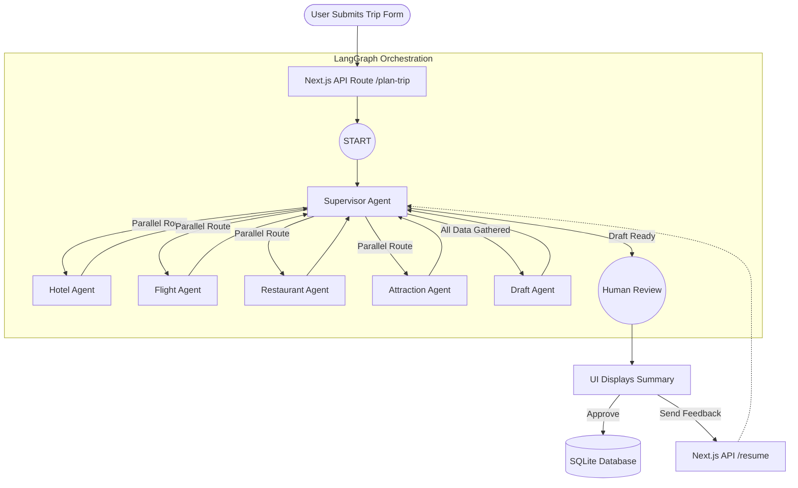

# Wanderlust AI: Architecture & Workflow Guide

> [!NOTE]
> This guide breaks down the technical architecture of the AI-powered travel planner, focusing heavily on the multi-agent orchestration using LangGraph.

## High-Level Architecture

The application is built on a modern, robust stack:
- **Frontend**: Next.js 16 (App Router), React 19, Framer Motion for animations.
- **Styling**: Vanilla CSS with custom properties (`globals.css`)—no Tailwind, ensuring a bespoke, premium aesthetic.
- **Database**: SQLite, managed through Prisma ORM.
- **Authentication**: NextAuth.js (Credentials Provider) with `bcryptjs`.
- **AI Orchestration**: `@langchain/langgraph` coupled with `@langchain/google-genai` and `@langchain/tavily` for live web search.

## LangGraph Multi-Agent Workflow

Instead of relying on a single massive LLM call, this application uses a **Multi-Agent System**. Various "specialist" agents run in parallel to gather data, which is then compiled by a "draft" agent, verified by a human, and finalized.

### 1. State Definition
LangGraph operates on a shared state. Our `GraphAnnotation` defines the schema for this state, tracking user inputs (destination, budget), gathered data (hotelData, flightData), and system routing status.

### 2. The Agent Nodes

#### The Supervisor (Router)
The `supervisorAgent` acts as a deterministic traffic controller. To save API quota, **it does not use an LLM**. Instead, it checks the state graph programmatically. 
- If research is missing, it routes to the research agents *in parallel*.
- If research is complete but no itinerary exists, it routes to the Draft Agent.
- If the draft is ready, it routes to the Human Review node.

#### The Researchers (Parallel Execution)
Four specialized agents gather real-time data using the **Tavily Search API**. If Tavily is unavailable, they fall back to Gemini's internal knowledge. Running these in parallel drastically reduces the time required to plan a trip.
1. **hotelAgent**: Finds accommodations fitting the budget.
2. **flightAgent**: Estimates transport options and costs.
3. **restaurantAgent**: Locates highly-rated local dining.
4. **attractionAgent**: Curates activities based on user preferences.

#### The Draft Agent
Once all parallel research nodes complete and merge their data into the state, the `draftAgent` takes over. It feeds all the raw text into Gemini and instructs it to output a strict, structured JSON array representing the multi-day itinerary.

### 3. Human-In-The-Loop (HITL)
After drafting, the graph hits an `END` node mapped to `humanReview`. 
- The Next.js API returns the current state (with the draft) to the frontend.
- The UI presents the draft to the user.
- If the user provides feedback (e.g., "Make it cheaper"), the frontend calls a `/resume` endpoint.
- The graph is resumed, the `supervisorAgent` detects the feedback, and immediately routes back to the `draftAgent` to rewrite the itinerary.

## Technical Workflow Diagram

## Optimizations for API Quotas

> [!IMPORTANT]
> The Agentic AI ecosystem imposes strict quotas on free tiers (e.g., 5 Requests Per Minute for Gemini).

This architecture implements several aggressive optimizations to prevent rate limiting:
1. **Deterministic Supervisor**: Routing logic is hardcoded rather than LLM-driven, saving 6+ LLM calls per trip.
2. **Tavily Offloading**: Web searches use Tavily. As long as the Tavily API key is valid, the 4 worker agents do not touch the Gemini API at all.
3. **Single Compilation**: Only the `draftAgent` relies heavily on Gemini to compile the final JSON, meaning a successful run requires exactly **1 LLM request**.
